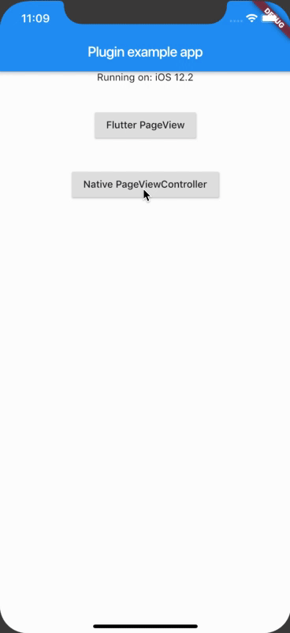

# Flutter Native PageViewController plugin

A Flutter plugin to use native ui to achieve page curl effect.

## The challenge

Flutter PageView widget does't support page curl transition. Neither OpenGL ES. Similar transition effect as native page curl is not likely achievable using pure Flutter/Dart at the moment.

Flutter provide few solutions to interact with native world.

1. PlatformView (UiKitView / AndroidView). Flutter map and web plugin are using this method. It is perfect solution for these ui controls that can be configurate with few parameters.
2. User FlutterViewController as standalone module.
https://github.com/flutter/flutter/wiki/Add-Flutter-to-existing-apps
3. Platfrom Channels
https://flutter.dev/docs/development/platform-integration/platform-channels
4. Plugin Packages
https://flutter.dev/docs/development/packages-and-plugins/developing-packages#developing-plugin-packages

The challenge is to implement the page curl effect using native ui controls, we still want to keep the sigle page view as Flutter widget.

## Sulotion Overview

1. Flutter main app (route /) use platform channel to call native codes. 
2. Native code create UIPageViewController (or Android  equivalent) with FlutterViewControllers/FlutterFragment arrays for each page in new Flutter/Dart ioslation.
3. Use setInitialRoute/initialRoute to route the FlutterViewController to specific page. Route name will be available as window.defaultRouteName, to determine which widget to create and pass to runApp.
4. Native plugin codes also create message channel between Flutter main app (data provoider) and Flutter page isolation. 
5. Flutter page widget parse window.defaultRouteName to get page index and retrieve data from Flutter main app using message channel.
6. Flutter page widget call native codes to close the native page view controller.

## How to use

1. Add pub package
2. Refactor runApp
3. Refactor page widget
4. Start NativePageViewController with page widget
5. Customise/Config native ui transition in native project.
